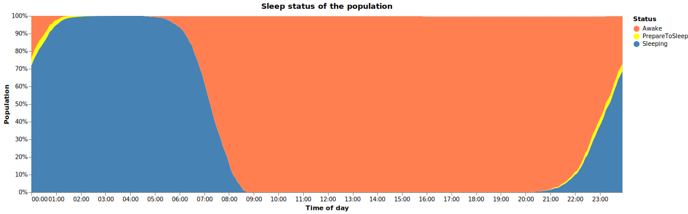

# ITBA ECD InfoViz
## VAST Challenge 2022

Tomando los datos del [VAST Challenge 2022](https://vast-challenge.github.io/2022/description.html), crear visualizaciones interesantes.

### Carga de datos

Dado el gran volumen de los datos, en particular de los `activity logs` (~18GBs en formato CSV), es necesario usar formatos/herramientas que soporten esos volúmenes. En este caso, se optó por usar **Apache Spark** para procesarlos, transformándolos a formato **parquet** y haciendo consultas sobre ellos. Para visualizar los datos, se usó **Altair** que permite crear gráficos flexibles via código desde la misma herramienta (**Python en Jupyter notebooks**).

### Estructura del repositorio

- [docker-compose.yml](https://github.com/toblich/itba-ecd-vast/blob/main/docker-compose.yml): Levanta un entorno de Jupyter con Spark instalado. Es necesario tener Docker instalado, y otorgarle amplios recursos para que pueda procesar los datos. **Requiere tener localmente una carpeta `Datasets/`** con el dataset original descargado. No se incluye en el repositorio debido al gran volumen de dicho dataset. Este docker-compose también monta volúmenes no solo con los notebooks sino también para persistir en formato parquet los datos que sean.
- [tobi/load_*.ipynb](https://github.com/toblich/itba-ecd-vast/tree/main/tobi): Son un par de jupyter notebooks que leen distintas partes del dataset original y lo pasan a formato parquet en un volumen montado. Al correrlos una vez cada uno, queda persistido en el host los archivos parquet con el dataset completo.
- [tobi/test.ipynb](https://github.com/toblich/itba-ecd-vast/blob/main/tobi/test.ipynb): Jupyter notebook que, leyendo datos en formato parquet, hace consultas y genera distintas visualizaciones. El objetivo era encontrar algo de información interesante. Las visualizaciones principales resultantes se incluyen más abajo en esta misma página.

### Visualizaciones resultantes

En esta sección se muestran todas las visualizaciones que se fueron creando, algunas más interesantes (y consecuentemente más refinadas también) que otras exploratorias que aportaron menos información. _**Se recomienda clonar el repositorio y abrir `tobi/test.ipynb` en un editor de notebooks para poder ver los gráficos con las interacciones habilitadas en cada uno, especialmente los tooltips**. No es necesario ejecutarlos, ya que la versión subida a este repositorio incluye ya las salidas de todas las celdas, por lo que pueden verse como están._ :bangbang:

#### Transacciones financieras

Primero se intentó analizar las transacciones financieras entre los participantes. Como se ve en la siguiente imagen, se observa que los salarios son la única fuente de ingresos significativa, si bien existen algunos ingresos (casi imperceptibles en general) por ajustes de alquileres. Los gastos principales de la población, de mayor a menor, son: la vivienda, ocio, comida, y en menor medida la educación.

Desglosando en el tiempo cada tipo de gasto, como muestra el siguiente gráfico múltiple de área, se ve que la artificialidad de los datos es evidente, llevando a patrones periódicos muy regulares. Por ejemplo, los salarios totales de la población no cambian durante el intervalo estudiado, y los mismos se distribuyen parejamente durante la  semana y caen considerablemente durante los fines de semana. Además, es exactamente el 1ro de cada más que se hacen todos los pagos de educación y de alquileres. También se observa que durante los fines de semana, además de bajar los ingresos, suben los gastos en recreación. Los gastos en comida varían poco durante todo el período; si bien tienen pequeña perturbaciones difíciles de ver en el gráfico por la escala, es verdad que se mantienen casi constantes todos los días.

#### Estados durante el día

Procesando los `acitivity_logs` que reportan todos los individuos cada 5 minutos durante todo el período, y agrupando todos los días del poco más de un año de datos, para toda la población, los siguiente gráficos muestran el estado de hambre, de ubicación y del sueño de la gente.

Se observa que el grueso de la población duerme aproximadamente entre las 11.30pm y las 7.15am, sin ser común que duerman siesta. Por otro lado, pareciera que la mayor parte de la gente tarda pocos minutos en dormirse, ya que la transición entre "preparándose para dormir" y "dormido" tiene que darse en un tiempo relativamente corto en la mayoría de los casos para que nunca haya una acumulación de gente en estado de "preparándose para dormir". Durante el tiempo que duermen, como es razonable, tienden a estar cada vez más hambrientos, haciendo que se despierten a la mañana en estado "starving". Se nota también que la población se despierta entre las 6am y las 9am, y que desayuna entre las 6 y las 10am, concentrada especialmente entre las 7 y las 9am aproximadamente. Las demás comidas, en cambio, no tienen un horario tan marcado, sino que se distribuye irregularmente entre el mediodía y pasada la medianoche.

Por otro lado, se ve que las horas pico de transporte, entre la gente yendo de sus casas al trabajo por la mañana y volviendo por la tarde (del trabajo o de actividades de ocio), se dan en las bandas de 6.30am-8.30am y a partir de las 4pm hasta la noche.
